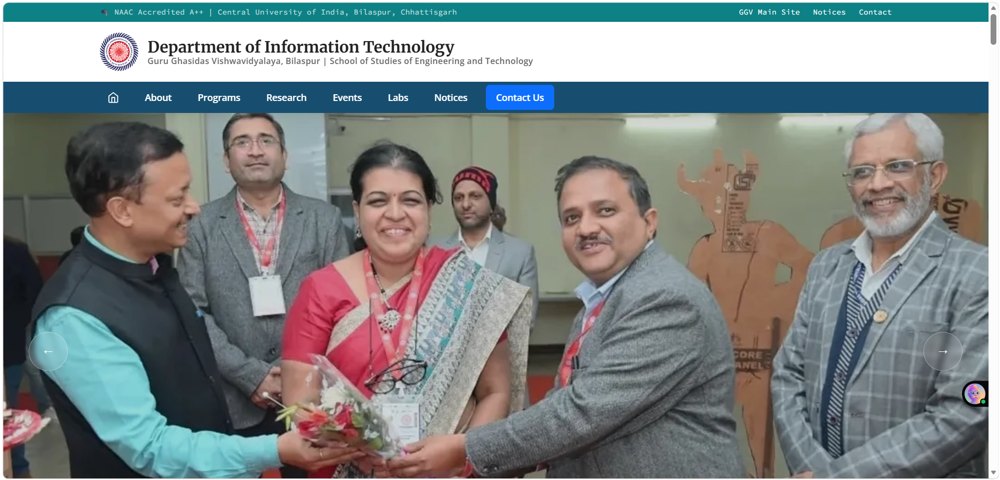
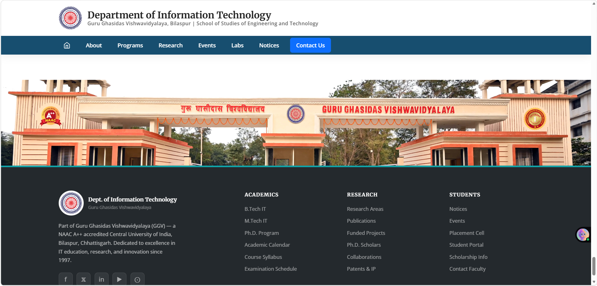

# 🏛️ GGV IT Department Website

<p align="center">
  
</p>

<p align="center">
  <b>Official website for the Information Technology Department, Guru Ghasidas Vishwavidyalaya, Bilaspur.</b>
</p>

<p align="center">
  
  
  
  
</p>

---

## 📖 About

The **GGV IT Department Website** is a modern and responsive web portal developed for the **Information Technology Department, Guru Ghasidas Vishwavidyalaya**. The platform provides easy access to department information, faculty details, academic resources, events, notices, and contact information through an intuitive and user-friendly interface.

---

## ✨ Features

- 🏛️ Department Overview
- 👨‍🏫 Faculty Information
- 📚 Academic Resources
- 📅 Events & Announcements
- 📢 Latest Notices
- 📱 Fully Responsive Design
- ⚡ Fast & Optimized Performance
- 🎨 Modern UI/UX

---

# 🖼️ Website Preview

## 🏠 Home Page

<p align="center">
  
</p>

---

## 🚁 Drone View

<p align="center">
  
</p>

---

## 📍 Footer

<p align="center">
  
</p>

---

# 🛠️ Tech Stack

| Technology | Purpose |
|------------|---------|
| React.js | Frontend |
| Vite | Build Tool |
| Tailwind CSS | Styling |
| JavaScript | Programming |
| HTML5 | Markup |
| CSS3 | Styling |

---

# 📂 Project Structure

```text
GGV-IT-Department-Website/
│
├── public/
├── src/
│   ├── assets/
│   ├── components/
│   ├── pages/
│   ├── styles/
│   └── App.jsx
│
├── screenshots/
│   ├── home.png
│   ├── drone-view.png
│   └── footer.png
│
├── package.json
└── README.md
```

---

# 🚀 Getting Started

### Clone the Repository

```bash
git clone https://github.com/yourusername/GGV-IT-Department-Website.git
```

### Navigate to the Project

```bash
cd GGV-IT-Department-Website
```

### Install Dependencies

```bash
npm install
```

### Start Development Server

```bash
npm run dev
```

---

# 📌 Future Improvements

- Student Login Portal
- Faculty Dashboard
- Admin Panel
- Online Notice Management
- Department Gallery
- Placement Section
- Alumni Portal
- Research Publications

---

# 🤝 Contributing

Contributions are welcome!

1. Fork the repository
2. Create a feature branch
3. Commit your changes
4. Push your branch
5. Open a Pull Request

---

# 📄 License

This project is licensed under the **MIT License**.

---

<div align="center">

### ⭐ If you like this project, don't forget to star the repository!

Developed with ❤️ for the Information Technology Department, Guru Ghasidas Vishwavidyalaya.

</div>
